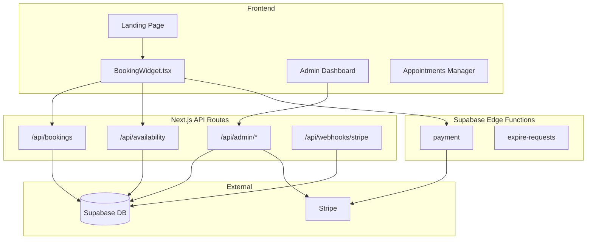

# CDL Training Booking System - Code Review & Refactor Plan

## Executive Summary

The RoyCuts codebase is a well-architected booking platform built with **Next.js 14** (App Router), **Supabase** (auth/database), **Stripe** (payments), and **React Native** (mobile). The core booking infrastructure is reusable; the barbershop-specific assumptions must be replaced with CDL training logic.

---

## Architecture Overview



---

## Component Analysis

### ✅ REUSE AS-IS

| Component | Location | Purpose |
|-----------|----------|---------|
| **Auth System** | `/app/auth/*`, `/api/auth/*` | Supabase Auth with profiles |
| **Stripe Integration** | `/lib/stripe.ts`, Edge Functions | PaymentIntents, SetupIntents, customer creation |
| **No-Show Charging** | `/api/admin/bookings/[id]/charge/` | Off-session charge via saved payment method |
| **Toast/Modal Components** | `/components/Toast.tsx`, `ReasonModal.tsx` | Reusable UI |
| **Rate Limiting** | `/lib/rateLimit.ts` | Server-side throttling |
| **Admin Layout** | `/app/admin/layout.tsx` | Sidebar, auth guards |

### 🔄 MODIFY

| Component | Changes Required |
|-----------|------------------|
| **BookingWidget.tsx** | Replace service selection → module selection; add capacity/group logic |
| **availability/route.ts** | Replace single-barber model → instructor + truck resource constraints |
| **bookings/route.ts** | Add module type validation; enforce group capacity; calculate per-seat pricing |
| **services table** | Rename → `training_modules`; add `capacity`, `module_type` enum |
| **bookings table** | Add `module_type`, `session_type`, `hours_logged`; rename `barber_id` → `instructor_id` |
| **Admin Appointments** | Add hour logging; adapt terminology |
| **Landing Page** | Full rebrand to Florida CDL |

### 🗑️ REMOVE

| Component | Reason |
|-----------|--------|
| Gallery Section | Not applicable for CDL |
| Barbershop imagery/icons | Replace with trucking theme |
| "Precision Cut" terminology | Replace with CDL terminology |

---

## Data Model Analysis

### Current Schema (Barbershop)

```sql
bookings (
  id, client_id, barber_id, service_id,
  start_datetime, end_datetime, status,
  payment_method, payment_status, amount_cents,
  setup_intent_id, payment_method_id, payment_intent_id
)

services (id, name, description, duration_min, price_cents, active)

availability_rules (barber_id, day_of_week, start_time, end_time)

profiles (id, role, full_name, phone, stripe_customer_id)
```

### Proposed Schema (CDL Training)

```sql
-- Rename services → training_modules
training_modules (
  id, name, description, duration_min, price_cents,
  module_type ENUM ('road', 'backing', 'pretrip'),
  capacity INT,        -- Max students (1=private, 2=backing pair, 8=group)
  requires_truck BOOL,
  requires_instructor BOOL,
  active
)

-- New: Track trucks
trucks (id, name, active)

-- New: Track instructors
instructors (
  id REFERENCES profiles(id),
  active,
  can_teach TEXT[] -- ['road', 'backing', 'pretrip']
)

-- Modified bookings
bookings (
  id, client_id, instructor_id, module_id,
  truck_id,                    -- NEW: Assigned truck
  session_type ENUM ('private', 'paired', 'group'),
  start_datetime, end_datetime, status,
  payment_method, payment_status, amount_cents,
  hours_logged INT DEFAULT 0,  -- NEW: Actual hours completed
  ...existing payment fields
)

-- Availability per instructor (replace barber_id)
instructor_availability (instructor_id, day_of_week, start_time, end_time)

-- NEW: Enrollment check
enrollments (student_id, program_id, enrolled_at, active)
```

---

## Stripe Integration Review

### Current Flow (REUSABLE)

1. **Payment Edge Function** (`/supabase/functions/payment/index.ts`)
   - Creates/retrieves Stripe Customer
   - Creates PaymentIntent (card) or SetupIntent (cash)
   - Uses `capture_method: 'manual'` for auth-hold

2. **Booking Validation** (`/api/bookings/route.ts`)
   - Verifies PaymentIntent status (`succeeded` or `requires_capture`)
   - Validates amount matches service price
   - Links payment to booking record

3. **No-Show Charging** (`/api/admin/bookings/[id]/charge/`)
   - Retrieves saved payment method from SetupIntent or customer
   - Creates off-session PaymentIntent with `confirm: true`
   - Updates booking status to `no_show_charged`

> [!IMPORTANT]
> The no-show charging flow is **fully reusable**. CDL sessions will use identical logic: students provide card-on-file; if they no-show, admin can charge the session fee.

---

## Calendar/Availability Logic

### Current Logic (`/api/availability/route.ts`)

1. Query `availability_rules` for day of week
2. Query existing bookings with buffer (15 min)
3. Generate 30-min slots within rules
4. Filter: slot + service duration must fit before closing
5. Filter: 12-hour advance booking rule
6. Filter: no collision with existing bookings

### Required Changes for CDL

| Current | CDL Requirement |
|---------|-----------------|
| Single barber blocks entire slot | Multiple instructors can work simultaneously |
| One service per slot | One module type per slot, but multiple students allowed |
| Buffer between clients | No buffer needed if same module continues |
| Any day booking | **Weekend only** (Sat/Sun) |

---

## CDL Business Rules to Implement

### Fixed Block: 8:00 AM - 9:00 AM Pre-Trip

- Always exists on every training day
- Group session, 6-8 students max
- $30/student
- No driving, no truck required
- Must exist before any driving blocks

### Flexible Blocks: 9:00 AM onwards

| Module | Type | Duration | Price | Capacity | Resources |
|--------|------|----------|-------|----------|-----------|
| Road Training | Private | 1 hr | $70 | 1 | 1 instructor, 1 truck |
| Backing Practice | Paired | 1 hr | $60/ea | 2 | 1 instructor, 1 truck |
| Pre-Trip Inspection | Group | 1 hr | $30/ea | 6-8 | 1 instructor, no truck |

### Enforcement Rules

1. **Module Isolation**: A time block can only have ONE module type
2. **Road Training**: Always private (capacity = 1)
3. **Backing Practice**: Max 2 students, shared wheel time
4. **Pre-Trip Group**: Respects capacity min/max
5. **Prepayment Required**: All bookings require payment before confirmation
6. **No Time Extension**: Late arrival does not extend booked time (note in confirmation)
7. **Enrollment Check**: Students must be enrolled before booking

---

## Refactor Plan - Phased Approach

### Phase 1: Data Model & Schema (CURRENT STOP POINT)
- [ ] Design final database schema
- [ ] Create migration scripts
- [ ] Define TypeScript types

### Phase 2: Calendar & Availability Engine
- [ ] Weekend-only filtering
- [ ] Resource constraint logic (instructors + trucks)
- [ ] Module-based slot generation
- [ ] Group capacity tracking

### Phase 3: Booking Flow
- [ ] Module selection UI (replace service selection)
- [ ] Capacity-aware booking (join existing sessions)
- [ ] Per-seat pricing calculation
- [ ] Confirmation with module/format/duration disclosure

### Phase 4: Admin & Hour Logging
- [ ] Instructor assignment UI
- [ ] Truck assignment UI
- [ ] Hour logging per student per module
- [ ] Session caps configuration

### Phase 5: Branding & Polish
- [ ] Landing page rebrand
- [ ] Email templates update
- [ ] Mobile app updates (if needed)

---

## Files Requiring Changes

### High Priority
- `database/schema.sql` - Full schema revision
- `frontend/app/api/availability/route.ts` - Resource-aware slots
- `frontend/app/api/bookings/route.ts` - Module/capacity validation
- `frontend/components/BookingWidget.tsx` - Module-based UI

### Medium Priority
- `frontend/app/admin/appointments/page.tsx` - Hour logging
- `frontend/app/admin/availability/` - Instructor scheduling
- `supabase/functions/payment/` - Module pricing
- `shared/types/index.ts` - TypeScript types

### Low Priority (Branding)
- `frontend/components/landing/*` - Rebrand all
- `frontend/app/globals.css` - Color scheme
- `email-templates/*` - CDL terminology

---

## Next Steps

Awaiting approval to proceed to **Phase 1: Data Model Design**.

I will provide:
1. Complete SQL schema for CDL training
2. TypeScript type definitions
3. Migration strategy for existing tables
